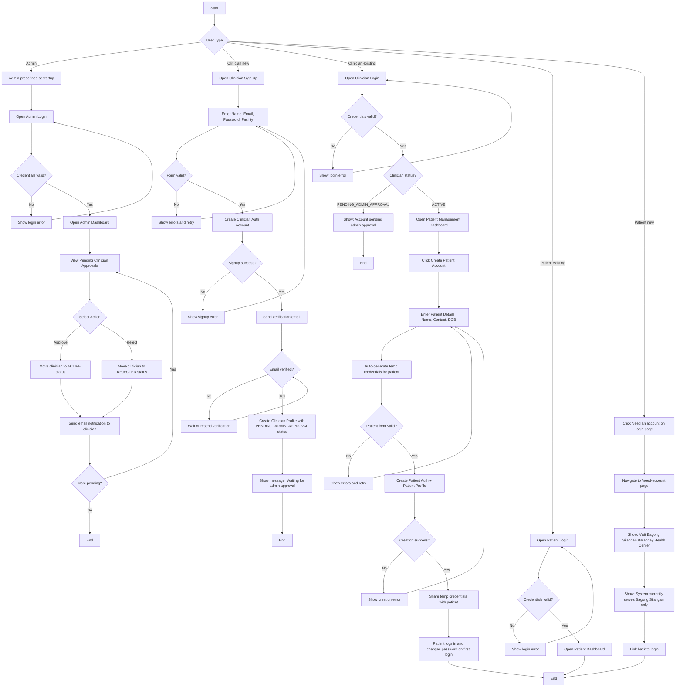

# Account Creation Flowchart

```mermaid
flowchart TD
    A[Start] --> B{User Type}

    %% ADMIN PATH (System-created, no self-signup)
    B -->|Admin| A1[Admin predefined at startup]
    A1 --> A2[Open Admin Login]
    A2 --> A3{Credentials valid?}
    A3 -->|No| A4[Show login error]
    A4 --> A2
    A3 -->|Yes| A5[Open Admin Dashboard]
    A5 --> A6[View Pending Clinician Approvals]
    A6 --> A7{Select Action}
    A7 -->|Approve| A8[Move clinician to ACTIVE status]
    A7 -->|Reject| A9[Move clinician to REJECTED status]
    A8 --> A10[Send email notification to clinician]
    A9 --> A10
    A10 --> A11{More pending?}
    A11 -->|Yes| A6
    A11 -->|No| A12[End]

    %% CLINICIAN NEW PATH
    B -->|Clinician new| C[Open Clinician Sign Up]
    C --> D[Enter Name, Email, Password, Facility]
    D --> E{Form valid?}
    E -->|No| E1[Show errors and retry]
    E1 --> D
    E -->|Yes| F[Create Clinician Auth Account]
    F --> G{Signup success?}
    G -->|No| G1[Show signup error]
    G1 --> D
    G -->|Yes| H[Send verification email]
    H --> I{Email verified?}
    I -->|No| I1[Wait or resend verification]
    I1 --> I
    I -->|Yes| J[Create Clinician Profile with PENDING_ADMIN_APPROVAL status]
    J --> J1[Show message: Waiting for admin approval]
    J1 --> J2[End]

    %% CLINICIAN EXISTING PATH
    B -->|Clinician existing| K[Open Clinician Login]
    K --> L{Credentials valid?}
    L -->|No| L1[Show login error]
    L1 --> K
    L -->|Yes| M{Clinician status?}
    M -->|PENDING_ADMIN_APPROVAL| M1[Show: Account pending admin approval]
    M1 --> M2[End]
    M -->|ACTIVE| N[Open Patient Management Dashboard]

    N --> O[Click Create Patient Account]
    O --> P[Enter Patient Details: Name, Contact, DOB]
    P --> Q[Auto-generate temp credentials for patient]
    Q --> R{Patient form valid?}
    R -->|No| R1[Show errors and retry]
    R1 --> P
    R -->|Yes| S[Create Patient Auth + Patient Profile]
    S --> T{Creation success?}
    T -->|No| T1[Show creation error]
    T1 --> P
    T -->|Yes| U[Share temp credentials with patient]
    U --> V[Patient logs in and changes password on first login]
    V --> W[End]

    %% PATIENT EXISTING PATH
    B -->|Patient existing| X[Open Patient Login]
    X --> Y{Credentials valid?}
    Y -->|No| Y1[Show login error]
    Y1 --> X
    Y -->|Yes| Z[Open Patient Dashboard]
    Z --> W

    %% PATIENT NEW PATH
    B -->|Patient new| X1[Click Need an account on login page]
    X1 --> X2[Navigate to /need-account page]
    X2 --> X3[Show: Visit Bagong Silangan Barangay Health Center]
    X3 --> X4[Show: System currently serves Bagong Silangan only]
    X4 --> X5[Link back to login]
    X5 --> W
```
