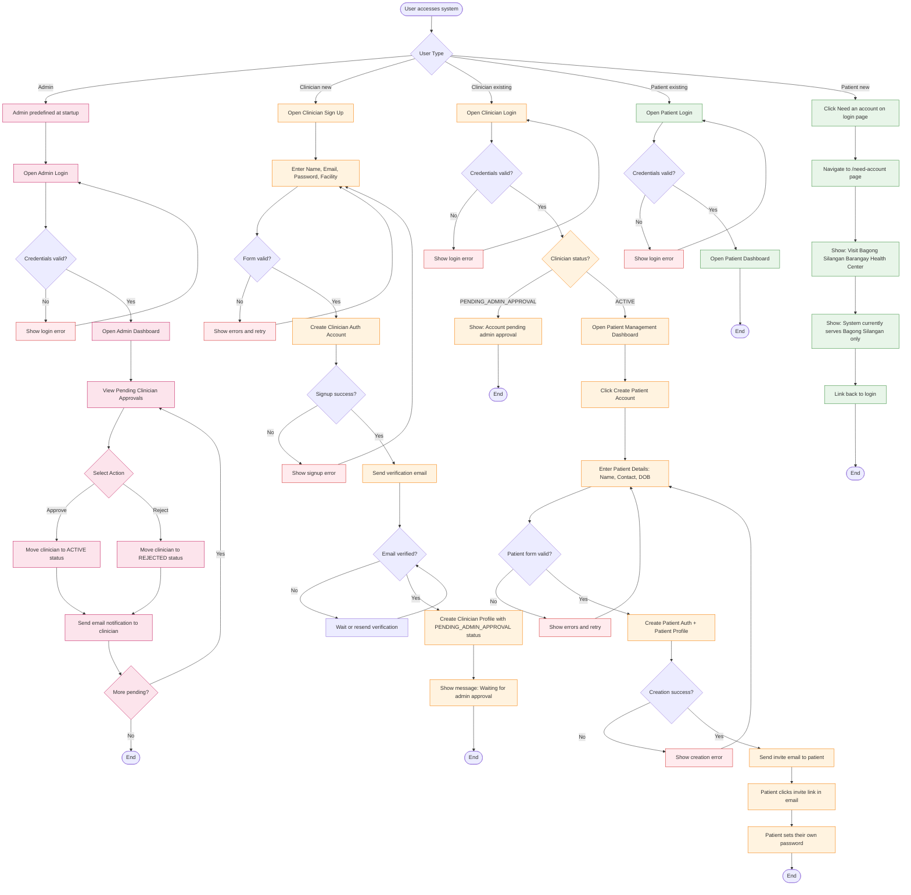

# Account Creation Flowchart

This document maps the account creation and authentication flows for all user types in the AI'll Be Sick system, including admin, clinician, and patient pathways.

## Overview

The system supports three user types with distinct account creation flows:

- **Admin**: Predefined at system startup, no self-signup available
- **Clinician**: Self-registration with email verification and admin approval required
- **Patient**: Created by clinicians or directed to health center for in-person registration

All flows include validation, error handling, and appropriate status management to ensure data integrity and security.

## Account Creation Flowchart

## Legend

### Node Types

| Shape   | Meaning         |
| ------- | --------------- |
| `([ ])` | Start/End point |
| `[ ]`   | Process/Action  |
| `{ }`   | Decision point  |

### Line Types

| Style          | Meaning                     |
| -------------- | --------------------------- |
| `-->`          | Normal flow                 |
| `-->\|label\|` | Conditional flow with label |

### Color Coding

| Color  | User Type / Purpose         |
| ------ | --------------------------- |
| Pink   | Admin-related processes     |
| Orange | Clinician-related processes |
| Green  | Patient-related processes   |
| Red    | Error states                |

## Flow Descriptions

### Admin Flow

**Purpose**: Admin and Developer users manage clinician approvals.

**Steps**:

1. Admin/Developer credentials are predefined in the system
2. Admin/Developer logs in with credentials
3. Upon successful login, admin/developer accesses the dashboard
4. Admin/Developer views pending clinician approval requests
5. Admin/Developer can approve or reject each clinician
6. Email notifications are sent to clinicians regardless of decision
7. Process repeats until all pending approvals are handled

**Key Points**:

- No self-signup for admins
- Admins have full control over clinician access
- Email notifications keep clinicians informed of their status

### Clinician New Account Flow

**Purpose**: New clinicians self-register and await admin approval.

**Steps**:

1. Clinician opens the sign-up page
2. Clinician enters required information (name, email, password, facility)
3. Form validation occurs in real-time
4. Upon valid form submission, auth account is created
5. Verification email is sent to clinician
6. Clinician must verify email address
7. After verification, clinician profile is created with PENDING_ADMIN_APPROVAL status
8. Clinician is informed they must wait for admin approval

**Key Points**:

- Email verification required before profile creation
- Profile status starts as PENDING_ADMIN_APPROVAL
- Clinician cannot access system until admin approves
- Clear messaging keeps clinician informed of status

### Clinician Existing Account Flow

**Purpose**: Existing clinicians log in and access their dashboard based on approval status.

**Steps**:

1. Clinician opens login page
2. Clinician enters credentials
3. System validates credentials
4. System checks clinician approval status
5. If PENDING_ADMIN_APPROVAL: Show pending message
6. If ACTIVE: Grant access to patient management dashboard

**Key Points**:

- Status check happens at every login
- Pending clinicians see clear messaging about their status
- Active clinicians can proceed to create patient accounts

### Patient Creation by Clinician Flow

**Purpose**: Clinicians create patient accounts and send invite emails for patients to set their own passwords.

**Steps**:

1. Clinician clicks "Create Patient Account" from dashboard
2. Clinician enters patient details (name, contact, date of birth)
3. Form validation occurs
4. Upon valid form submission, patient auth and profile are created
5. System sends invite email to patient's email address
6. Patient clicks the invite link in the email
7. Patient is redirected to set-password page
8. Patient sets their own password
9. Patient can now log in with their email and password

**Key Points**:

- Clinician-initiated patient creation
- Real email verification (patient must receive and click the invite link)
- No temporary credentials needed
- Patient sets their own password from the start
- More secure and user-friendly than temp password approach
- Clear error handling for failed creations

### Patient Invite Resend Flow

**Purpose**: Admins can resend invite emails to patients if the original invite expired or wasn't received.

**Steps**:

1. Admin navigates to Users page
2. Admin clicks "Resend Invite" button
3. Modal opens requesting patient's email address
4. Admin enters patient's email and confirms
5. System validates the patient exists in the system
6. System sends a new invite email with a fresh 24-hour expiration
7. Patient receives new invite link and can set their password

**Key Points**:

- Only admins can resend invites (role hierarchy: DEVELOPER > ADMIN > CLINICIAN > PATIENT)
- Invite links expire after 24 hours (configurable in Supabase)
- Each resend generates a new token with full 24-hour validity
- If patient already set password, system returns error message

### Expired Invite Handling

**Purpose**: Gracefully handle cases where invite links have expired or are invalid.

**Steps**:

1. User clicks invite link
2. System processes the invite token
3. If token is expired, missing, or already used:
   - User is redirected to /auth/expired-invite page
   - Page explains the invite has expired
   - Instructions provided to contact clinician for new invite
4. Alternatively, user may be redirected to /auth/auth-code-error with `no_token` error

**Key Points**:

- Clear user messaging about what happened
- Guidance on next steps (contact clinician)
- Admins can resend invites from Users page
- No security vulnerabilities in error handling

### Patient Existing Account Flow

**Purpose**: Existing patients log in to access their dashboard.

**Steps**:

1. Patient opens login page
2. Patient enters credentials (email/password or Google sign-in)
3. System validates credentials
4. For Google sign-in: System verifies patient exists in database (pre-registered by clinician)
5. If patient not found: Redirect to "Need an account" page
6. Upon successful validation, patient dashboard opens

**Key Points**:

- Simple authentication flow
- Direct access to patient dashboard
- Google sign-in only available for pre-registered patients
- Clinician-entered patient name is preserved (not overwritten by Google account name)

### Patient New Account Flow

**Purpose**: New patients are directed to visit the health center for in-person registration.

**Steps**:

1. Patient clicks "Need an account" on login page
2. Patient is navigated to /need-account page
3. System displays message to visit Bagong Silangan Barangay Health Center
4. System explains it currently serves Bagong Silangan only
5. Patient is provided link back to login

**Key Points**:

- No online self-registration for patients
- In-person registration required at health center
- Clear messaging about service area limitations
- Easy navigation back to login

## Route Reference

This section lists all routes referenced in the account creation flows.

| Route                                                           | Description                                      |
| --------------------------------------------------------------- | ------------------------------------------------ |
| `/login`                                                        | Main login page                                  |
| `/need-account`                                                 | Account selection page                           |
| `/clinician-signup`                                             | Clinician self-registration page                 |
| `/clinician-login`                                              | Clinician login page                             |
| `/clinician-forgot-password` — Clinician password reset request |
| `/clinician-reset-password` — Clinician password reset form     |
| `/waiting-for-approval`                                         | Pending approval page for unapproved clinicians  |
| `/dashboard`                                                    | Clinician dashboard                              |
| `/users`                                                        | User management page                             |
| `/create-patient`                                               | Create patient account page                      |
| `/patient/set-password`                                         | Patient password setting page (from invite link) |
| `/auth/expired-invite`                                          | Expired invite error page                        |
| `/auth/auth-code-error`                                         | OAuth/auth error page                            |

## Status Definitions

### Clinician Statuses

| Status                   | Description                                                          |
| ------------------------ | -------------------------------------------------------------------- |
| `PENDING_ADMIN_APPROVAL` | Clinician has registered and verified email, awaiting admin approval |
| `ACTIVE`                 | Admin has approved clinician, full access granted                    |
| `REJECTED`               | Admin has rejected clinician application                             |

### Patient Statuses

| Status   | Description                                         |
| -------- | --------------------------------------------------- |
| `ACTIVE` | Patient account created by clinician, ready for use |

## Technical Notes

1. **Admin Predefined**: Admin accounts are created at system startup via environment variables or configuration, not through the UI
2. **Email Verification**: Clinician email verification uses Supabase Auth's built-in verification flow
3. **Patient Invite Flow**: Patient accounts use Supabase's inviteUserByEmail() to send invite links. Patients click the link to set their own password, ensuring real email verification and eliminating temp password complications
4. **Password Security**: Patients set their own password via the invite link, ensuring they always know their password and don't need to remember temporary credentials
5. **Status Persistence**: Clinician status is stored in the database and checked at every login
6. **Email Notifications**: Admin approval/rejection triggers email notifications to clinicians via Supabase
7. **Service Area Limitation**: The system currently serves only Bagong Silangan Barangay Health Center
8. **Form Validation**: All forms include client-side and server-side validation for data integrity
9. **Error Recovery**: All error states include clear messaging and retry options
10. **Security**: Temporary credentials and password changes ensure patient account security
11. **Resend Invite Feature**: Admins can resend invite emails from the Users page. Each resend generates a new token with full 24-hour validity
12. **Invite Expiration**: Invite tokens expire after 24 hours. Expired invites redirect users to /auth/expired-invite page with clear instructions
13. **Role-Based Access**: Resend Invite is only available to ADMIN and DEVELOPER roles (via role hierarchy)
14. **Client-Side Token Extraction**: Invite links contain tokens in URL hash fragments (#access_token=...). Client-side JavaScript extracts these tokens after server-side processing
