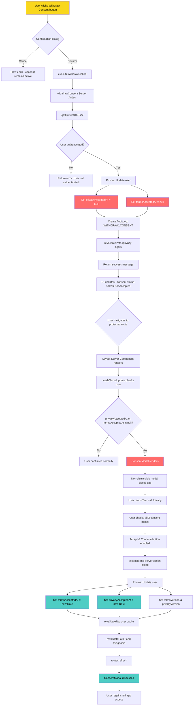
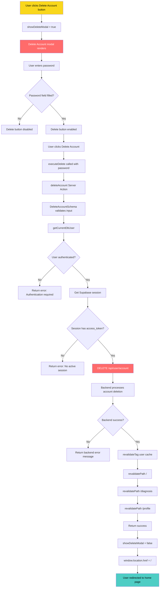
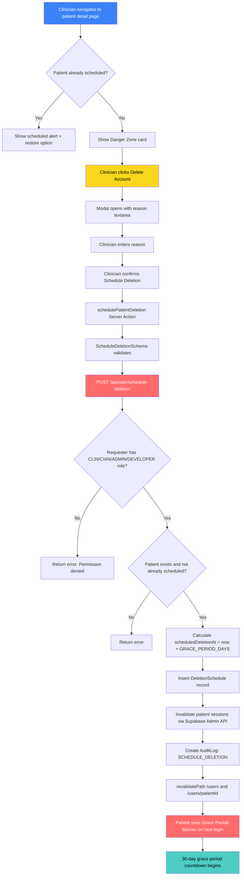
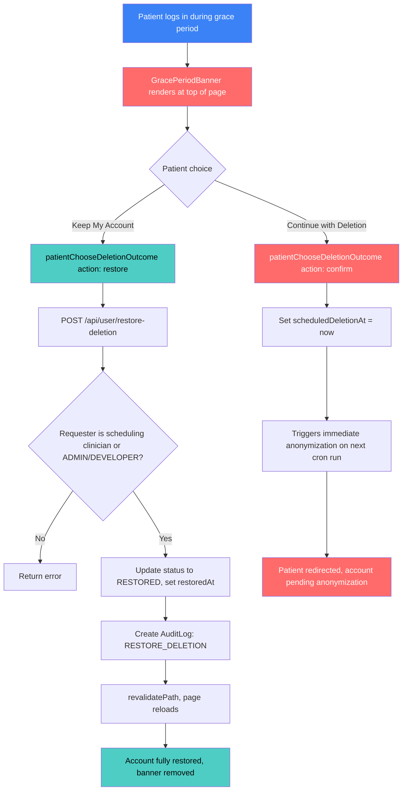
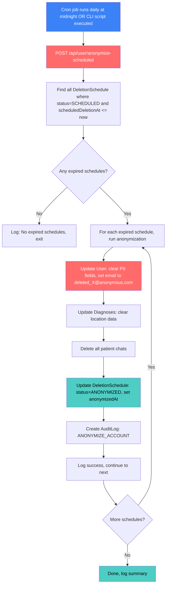

# Consent Withdrawal & Re-Acceptance Flow

## Flow Summary

### Withdrawal Path (Top)

1. User clicks the warning-styled "Withdraw Consent" button
2. Browser confirmation dialog appears
3. If confirmed, the `withdrawConsent` server action runs
4. Database sets `privacyAcceptedAt` and `termsAcceptedAt` to `null`
5. An audit log entry records the withdrawal
6. UI reflects the withdrawn status

### Re-Acceptance Path (Bottom)

1. On next navigation to any protected route, the layout checks consent status
2. `needsTermsUpdate()` detects null timestamps and returns `true`
3. `ConsentModal` renders as a non-dismissible overlay blocking the app
4. User must check all three consent checkboxes
5. Clicking "Accept & Continue" calls the `acceptTerms` server action
6. Database records new timestamps and current document versions
7. Cache is invalidated and page refreshes
8. Modal dismisses and full app access is restored

---

## Delete Account Flow

### Delete Account Flow Summary

1. User clicks the error-styled "Delete Account" button (from `/profile` or privacy-rights page)
2. Delete Account modal renders with a password input field
3. User must enter their password — the Delete button stays disabled until password is provided
4. Clicking "Delete Account" calls the `deleteAccount` server action with the password
5. Server action validates input via `DeleteAccountSchema`
6. Authenticates user via `getCurrentDbUser()` and Supabase session
7. Sends `DELETE` request to backend at `/api/user/account` with Bearer token
8. Backend permanently deletes the account and anonymizes data
9. On success: cache tags are invalidated and paths (`/`, `/diagnosis`, `/profile`) are revalidated
10. Modal closes and user is redirected to the home page via `window.location.href = "/"`

---

## Clinician-Initiated Patient Deletion Flow (with Grace Period)

### Scheduling Deletion

### Patient Grace Period Response

### Automated Anonymization (Cron / CLI)

### Key Behaviors

| Scenario | Behavior |
|----------|----------|
| Patient submits symptoms during grace period | Allowed, banner shows on every page |
| Clinician who scheduled deletion is inactive | ADMIN or DEVELOPER can restore |
| GRACE_PERIOD_DAYS=0 | Immediate anonymization (demo mode) |
| Multiple schedules for same patient | Prevented by unique constraint on userId |
| Patient confirms deletion early | scheduledDeletionAt set to now, anonymizes on next cron run |

### Clinician UI Components

- **Users List Page**: "Pending Deletion" tab with badge count showing patients scheduled for deletion
- **User Detail Page**: Danger Zone card with delete modal (active patients) or warning alert with restore button (scheduled patients)
- **Patient Layout**: Grace period banner with "Keep My Account" and "Continue with Deletion" options
