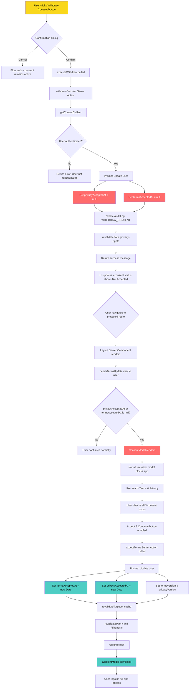

# Consent Withdrawal & Re-Acceptance Flow

## Flow Summary

### Withdrawal Path (Top)
1. User clicks the warning-styled "Withdraw Consent" button
2. Browser confirmation dialog appears
3. If confirmed, the `withdrawConsent` server action runs
4. Database sets `privacyAcceptedAt` and `termsAcceptedAt` to `null`
5. An audit log entry records the withdrawal
6. UI reflects the withdrawn status

### Re-Acceptance Path (Bottom)
1. On next navigation to any protected route, the layout checks consent status
2. `needsTermsUpdate()` detects null timestamps and returns `true`
3. `ConsentModal` renders as a non-dismissible overlay blocking the app
4. User must check all three consent checkboxes
5. Clicking "Accept & Continue" calls the `acceptTerms` server action
6. Database records new timestamps and current document versions
7. Cache is invalidated and page refreshes
8. Modal dismisses and full app access is restored
