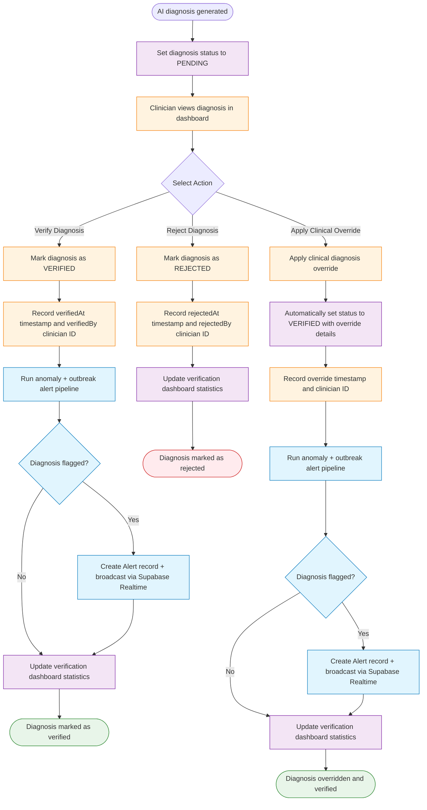

# Diagnosis Verification Flowchart

This document maps the diagnosis verification workflow for clinicians in the AI'll Be Sick system, including verification, rejection, clinical override, and dashboard statistics updates.

## Overview

The system implements diagnosis verification tracking where clinicians can verify or reject AI-generated diagnoses. This includes:

- **Verification**: Clinicians can confirm AI diagnoses as accurate
- **Rejection**: Clinicians can reject inaccurate AI diagnoses
- **Override**: Clinical overrides automatically trigger verification status
- **Tracking**: All actions are audited with timestamps and user IDs

All verification actions update dashboard statistics and maintain audit trails for clinical oversight.

## Diagnosis Verification Flowchart

## Legend

### Node Types

| Shape   | Meaning         |
| ------- | --------------- |
| `([ ])` | Start/End point |
| `[ ]`   | Process/Action  |
| `{ }`   | Decision point  |

### Line Types

| Style          | Meaning                     |
| -------------- | --------------------------- |
| `-->`          | Normal flow                 |
| `-->\|label\|` | Conditional flow with label |

### Color Coding

| Color  | User Type / Purpose         |
| ------ | --------------------------- |
| Orange | Clinician-related processes |
| Green  | Success states (verified)   |
| Red    | Error states (rejected)     |
| Purple | System processes            |

## Flow Descriptions

### Diagnosis Generation Flow

**Purpose**: AI generates initial diagnosis with pending verification status.

**Steps**:

1. AI system processes symptoms and generates disease prediction
2. Diagnosis record created with PENDING status
3. Diagnosis appears in clinician dashboard for review

**Key Points**:

- All AI diagnoses start as PENDING
- No automatic verification occurs
- Requires clinician intervention for final status

### Verification Flow

**Purpose**: Clinicians confirm accurate AI diagnoses.

**Steps**:

1. Clinician reviews diagnosis details in dashboard
2. Clinician selects "Verify Diagnosis" action
3. System updates status to VERIFIED
4. System records verification timestamp and clinician ID
5. System runs anomaly and outbreak alert pipeline (fire-and-forget)
6. If diagnosis is flagged as anomalous, an Alert record is created and broadcast via Supabase Realtime
7. Dashboard statistics updated to reflect verification

**Key Points**:

- Verification indicates clinical acceptance of AI diagnosis
- Audit trail maintained for compliance
- Statistics help track verification rates
- Alert pipeline runs asynchronously and never blocks the verification response

### Rejection Flow

**Purpose**: Clinicians reject inaccurate AI diagnoses.

**Steps**:

1. Clinician reviews diagnosis details in dashboard
2. Clinician selects "Reject Diagnosis" action
3. System updates status to REJECTED
4. System records rejection timestamp and clinician ID
5. Dashboard statistics updated to reflect rejection

**Key Points**:

- Rejection indicates clinical disagreement with AI diagnosis
- Audit trail maintained for quality improvement
- Statistics help identify areas needing AI model improvement

### Clinical Override Flow

**Purpose**: Clinicians apply their own diagnosis, automatically verified.

**Steps**:

1. Clinician reviews diagnosis details in dashboard
2. Clinician selects "Apply Clinical Override" action
3. Clinician provides override diagnosis details
4. System automatically sets status to VERIFIED
5. System records override timestamp and clinician ID
6. System runs anomaly and outbreak alert pipeline (fire-and-forget)
7. If diagnosis is flagged as anomalous, an Alert record is created and broadcast via Supabase Realtime
8. Dashboard statistics updated

**Key Points**:

- Overrides represent clinician expertise over AI
- Automatic verification prevents double-review
- Override details preserved for audit and analysis
- Alert pipeline runs after auto-verification, same as direct verification

## Status Definitions

### Diagnosis Statuses

| Status   | Description                                                          |
| -------- | -------------------------------------------------------------------- |
| PENDING  | Initial status for all AI-generated diagnoses, awaiting review       |
| VERIFIED | Diagnosis confirmed by clinician (either direct verification or override) |
| REJECTED | Diagnosis rejected by clinician as inaccurate                        |

## Technical Notes

1. **Audit Tracking**: All verification actions record user ID and timestamp for compliance
2. **Dashboard Statistics**: Real-time updates to verification metrics after each action
3. **Transaction Support**: Override operations use database transactions for consistency
4. **Role Restrictions**: Only CLINICIAN, ADMIN, and DEVELOPER roles can perform verification actions
5. **Status Immutability**: Once VERIFIED or REJECTED, status cannot be changed
6. **Override Integration**: Clinical overrides automatically trigger VERIFIED status to streamline workflow
7. **Alert Pipeline Integration**: After any diagnosis transitions to VERIFIED (via approve, batch approve, or override), the anomaly and outbreak alert pipeline runs asynchronously. This ensures only clinician-confirmed cases enter the surveillance system. The alert pipeline is fire-and-forget and never blocks the verification response.
8. **Backend Data Filter**: Both `surveillance_service.py` and `outbreak_service.py` only query diagnoses with `status = 'VERIFIED'`, so the alert pipeline will only flag diagnoses that have been confirmed by a clinician.