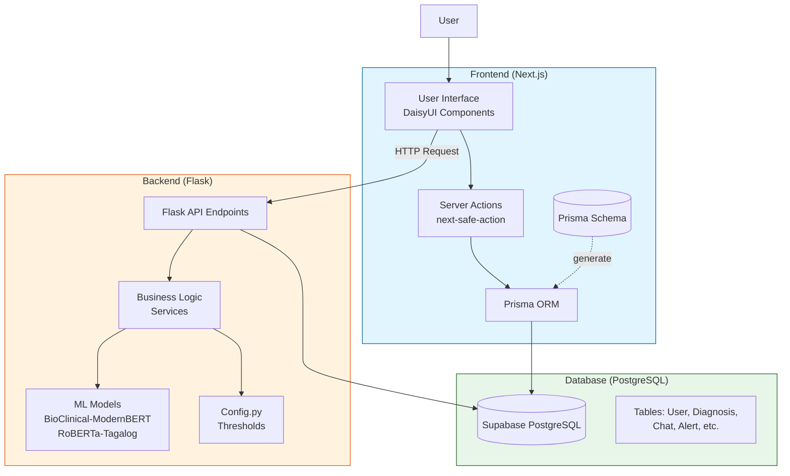
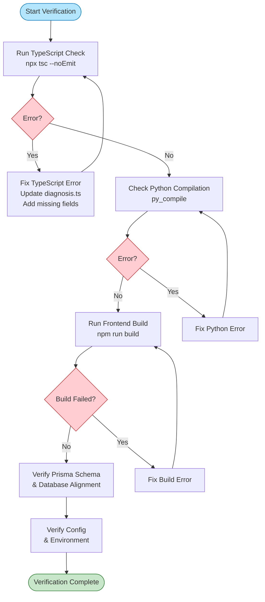
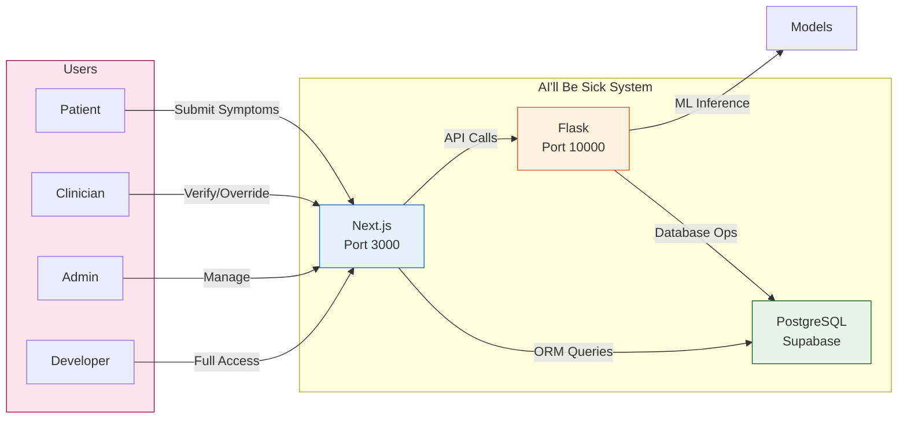

# Implementation Verification Flowchart



## Verification Process Flowchart



## System Architecture Overview



## Role Hierarchy

```mermaid
flowchart TD
    DEVEL[DEVELOPER<br/>Level 3] --> ADMIN[ADMIN<br/>Level 2]
    ADMIN --> CLINICIAN[CLINICIAN<br/>Level 1]
    CLINICIAN --> PATIENT[PATIENT<br/>Level 0]
    
    DEVEL -.->|Inherits all| PATIENT
    ADMIN -.->|Inherits| PATIENT
    CLINICIAN -.->|Inherits| PATIENT
    
    style DEVEL fill:#ff8a80,stroke:#c62828
    style ADMIN fill:#ffcc80,stroke:#ef6c00
    style CLINICIAN fill:#ffff80,stroke:#f9a825
    style PATIENT fill:#b9f6ca,stroke:#2e7d32