# Surveillance PDF Export Flowchart

This document maps the PDF export flow for surveillance reports in the AI'll Be Sick system, including image capture, data preparation, and PDF generation processes.

## Overview

The surveillance PDF export process involves:

- **Image Capture**: Capturing map and chart visualizations using dom-to-image
- **Data Preparation**: Collecting tabular data, columns, and metadata
- **PDF Generation**: Assembling the PDF with professional formatting, sections, and styling

The flow ensures high-quality epidemiological reports with proper visual hierarchy and data integrity.

## Surveillance PDF Export Flowchart

```mermaid
flowchart TD
    %% ========== ENTRY POINT ==========
    Start([User clicks Export on Surveillance Tab]) --> CaptureImages[Capture Images from DOM]

    %% ========== IMAGE CAPTURE ==========
    CaptureImages --> MapElement{Map element found?}
    MapElement -->|Yes| CaptureMap[Capture Map with dom-to-image]
    MapElement -->|No| SkipMap[Skip map capture]
    CaptureMap --> ChartElement{Chart element found?}
    SkipMap --> ChartElement
    ChartElement -->|Yes| CaptureChart[Capture Chart with dom-to-image]
    ChartElement -->|No| SkipChart[Skip chart capture]
    CaptureChart --> PrepareData[Prepare Export Data]
    SkipChart --> PrepareData

    %% ========== DATA PREPARATION ==========
    PrepareData --> GetColumns[Get Surveillance Columns based on tab/dataType]
    GetColumns --> BuildMetadata[Build Export Metadata: title, subtitle, filename]
    BuildMetadata --> CreateExportData[Create ExportData object with images, columns, metadata]
    CreateExportData --> CallPdfExport[Call exportToPDF function]

    %% ========== PDF GENERATION ==========
    CallPdfExport --> SetupDoc[Setup jsPDF document with Geist font]
    SetupDoc --> AddHeader[Add system header: CDSRS]
    AddHeader --> AddTitle[Add main title: Epidemiological Summary Report]
    AddTitle --> AddMetadata[Add facility, export date, reporting period metadata]
    AddMetadata --> ProcessImages{Images to process?}

    %% ========== IMAGE PROCESSING LOOP ==========
    ProcessImages -->|Yes| GetNextImage[Get next image from array]
    GetNextImage --> AddImageTitle[Add section title in bold]
    AddImageTitle --> AddImageSubtext[Add explanatory subtext]
    AddImageSubtext --> AddImageDivider[Add horizontal divider line]
    AddImageDivider --> ScaleImage[Scale image to fit page width/height]
    ScaleImage --> CenterImage[Center image horizontally on page]
    CenterImage --> IsMap{Image is Map?}
    IsMap -->|Yes| AddLegend[Add heatmap legend below image]
    IsMap -->|No| SkipLegend[Skip legend]
    AddLegend --> CheckMoreImages{More images?}
    SkipLegend --> CheckMoreImages
    CheckMoreImages -->|Yes| GetNextImage
    CheckMoreImages -->|No| AddTableSection[Add table section]

    %% ========== TABLE PROCESSING ==========
    AddTableSection --> AddTableTitle[Add table title: Verified Case Registry & Confidence Analysis]
    AddTableTitle --> AddTableSubtext[Add table subtext explanation]
    AddTableSubtext --> AddTableDivider[Add horizontal divider line]
    AddTableDivider --> PrepareTableData[Prepare table data with formatting]
    PrepareTableData --> GenerateTable[Generate autoTable with green headers]
    GenerateTable --> AddFooter[Add generated date and page info]
    AddFooter --> SavePdf[Save PDF with timestamped filename]
    SavePdf --> End([PDF download completes])

    %% ========== ERROR HANDLING ==========
    ProcessImages -->|No| AddTableSection
    CaptureMap --> ErrorCaptureMap[Handle capture error] --> ChartElement
    CaptureChart --> ErrorCaptureChart[Handle capture error] --> PrepareData

    %% ========== STYLES ==========
    classDef captureNode fill:#bbdefb,stroke:#1976d2,color:#000
    classDef processNode fill:#ce93d8,stroke:#7b1fa2,color:#000
    classDef pdfNode fill:#a5d6a7,stroke:#388e3c,color:#000
    classDef errorNode fill:#ef9a9a,stroke:#d32f2f,color:#000

    %% Apply styles to nodes
    class CaptureImages,CaptureMap,CaptureChart,MapElement,ChartElement captureNode
    class GetColumns,BuildMetadata,CreateExportData,PrepareData,ScaleImage,CenterImage,PrepareTableData processNode
    class SetupDoc,AddHeader,AddTitle,AddMetadata,AddImageTitle,AddImageSubtext,AddImageDivider,AddTableTitle,AddTableSubtext,AddTableDivider,GenerateTable,AddFooter,SavePdf pdfNode
    class ErrorCaptureMap,ErrorCaptureChart,SkipMap,SkipChart errorNode
```

## Simplified Overview (Non-Technical)

This version shows the same process in plain language without technical details.

```mermaid
flowchart TD
    %% ========== ENTRY POINT ==========
    Start([User clicks Export Button]) --> GetReady[System prepares to create your report]

    %% ========== IMAGE CAPTURE ==========
    GetReady --> CheckMap{Is there a map?}
    CheckMap -->|Yes| SaveMap[Save a picture of the map]
    CheckMap -->|No| NextMap[No map to save]
    SaveMap --> CheckChart{Is there a chart?}
    NextMap --> CheckChart
    CheckChart -->|Yes| SaveChart[Save a picture of the chart]
    CheckChart -->|No| NextChart[No chart to save]
    SaveChart --> GatherInfo[Gather report information]
    NextChart --> GatherInfo

    %% ========== DATA PREPARATION ==========
    GatherInfo --> GetTableData[Get the case data table]
    GetTableData --> GetDetails[Get report details like facility name and date]
    GetDetails --> StartPdf[Start building the PDF]

    %% ========== PDF GENERATION ==========
    StartPdf --> AddHeader[Add report header with system name]
    AddHeader --> AddTitle[Add report title]
    AddTitle --> AddInfo[Add facility name and date]
    AddInfo --> CheckImages{Are there pictures?}

    %% ========== IMAGE PROCESSING LOOP ==========
    CheckImages -->|Yes| AddPicTitle[Add picture title]
    AddPicTitle --> AddPicDesc[Add description below title]
    AddPicDesc --> AddLine[Add separator line]
    AddLine --> PlacePic[Place and center the picture]
    PlacePic --> IsMapPic{Is it a map?}
    IsMapPic -->|Yes| AddKey[Add map color guide]
    IsMapPic -->|No| SkipKey[Skip the guide]
    AddKey --> MorePics{More pictures?}
    SkipKey --> MorePics
    MorePics -->|Yes| AddPicTitle
    MorePics -->|No| AddTable[Add the case data table]

    %% ========== TABLE PROCESSING ==========
    AddTable --> AddTableTitle[Add table title]
    AddTableTitle --> AddTableDesc[Add table description]
    AddTableDesc --> AddTableLine[Add separator line]
    AddTableLine --> FormatTable[Format table with green headers]
    FormatTable --> AddFooter[Add date and page numbers]
    AddFooter --> Download[Download your PDF report]
    Download --> End([Report saved to your device])

    %% ========== ERROR HANDLING ==========
    CheckImages -->|No| AddTable
    SaveMap --> PicError[Skip picture if error] --> CheckChart
    SaveChart --> PicError

    %% ========== STYLES ==========
    classDef captureNode fill:#bbdefb,stroke:#1976d2,color:#000
    classDef processNode fill:#ce93d8,stroke:#7b1fa2,color:#000
    classDef pdfNode fill:#a5d6a7,stroke:#388e3c,color:#000
    classDef errorNode fill:#ef9a9a,stroke:#d32f2f,color:#000

    %% Apply styles to nodes
    class CheckMap,SaveMap,CheckChart,SaveChart,IsMapPic,MorePics captureNode
    class GetReady,GatherInfo,GetTableData,GetDetails,PlacePic,FormatTable processNode
    class StartPdf,AddHeader,AddTitle,AddInfo,AddPicTitle,AddPicDesc,AddLine,AddKey,AddTable,AddTableTitle,AddTableDesc,AddTableLine,AddFooter,Download pdfNode
    class PicError,NextMap,NextChart,SkipKey errorNode
```

## Legend

### Node Types

| Shape   | Meaning         |
| ------- | --------------- |
| `([ ])` | Start/End point |
| `[ ]`   | Process/Action  |
| `{ }`   | Decision point  |

### Line Types

| Style          | Meaning                     |
| -------------- | --------------------------- |
| `-->`          | Normal flow                 |
| `-->\|label\|` | Conditional flow with label |

### Color Coding

| Color  | Process Type               |
| ------ | -------------------------- |
| Blue   | Image capture operations   |
| Purple | Data preparation processes |
| Green  | PDF generation and output  |
| Red    | Error handling and skips   |

## Flow Descriptions

### Image Capture Phase

**Purpose**: Capture high-quality visualizations from the browser DOM for inclusion in the PDF.

**Steps**:

1. User initiates export from surveillance tab
2. System attempts to capture map element using dom-to-image
3. If map capture succeeds, attempts chart capture
4. Captures use quality settings and filter out problematic elements
5. Images are stored as data URLs for PDF inclusion

**Key Points**:

- Graceful handling of missing elements
- Quality optimization for PDF rendering
- Error recovery allows partial exports

### Data Preparation Phase

**Purpose**: Gather and format all data needed for the report.

**Steps**:

1. Retrieve appropriate columns based on surveillance tab and data type
2. Build metadata including title, subtitle, and filename
3. Package export data object with images, columns, and metadata
4. Pass prepared data to PDF export function

**Key Points**:

- Dynamic column generation per tab type
- Metadata includes facility and date information
- Structured data ensures consistent PDF output

### PDF Generation Phase

**Purpose**: Assemble professional epidemiological report with proper formatting.

**Steps**:

1. Initialize jsPDF document with Geist font
2. Add system header and main title
3. Include facility metadata below title
4. Process each captured image:
   - Add bold section title
   - Add explanatory subtext
   - Draw horizontal divider
   - Scale and center image
   - Add legend for map images
5. Add table section with title, subtext, and divider
6. Generate formatted table with green headers
7. Add footer with generation info
8. Save PDF with timestamped filename

**Key Points**:

- Professional epidemiological formatting
- Visual hierarchy with titles, subtext, and dividers
- Centered image placement
- Map-specific legend inclusion
- Automatic table styling and pagination

## Technical Notes

1. **Image Scaling**: Images are scaled to fit page dimensions while maintaining aspect ratio
2. **Font Consistency**: All text uses Geist font family for professional appearance
3. **Color Scheme**: Green headers for table, muted colors for metadata and legends
4. **Error Handling**: System gracefully handles missing images or data
5. **Performance**: DOM-to-image captures are optimized for quality vs. speed
6. **Accessibility**: Clear section hierarchy and descriptive text
7. **Responsive**: PDF layout adapts to content length with automatic pagination
