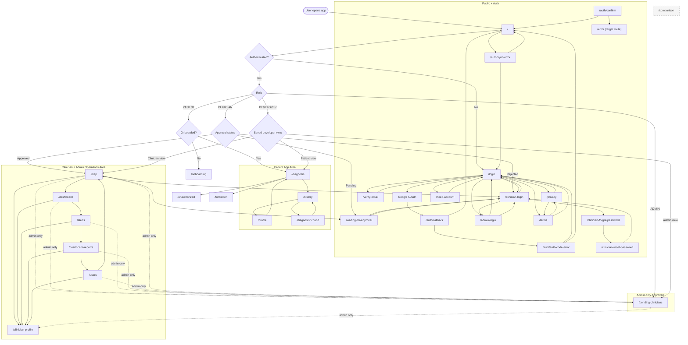

# System Page Navigation Flowchart

This document maps the whole-page navigation across the AI'll Be Sick frontend, including role-based entry paths, auth flows, patient pages, clinician/admin pages, and guard redirects.

