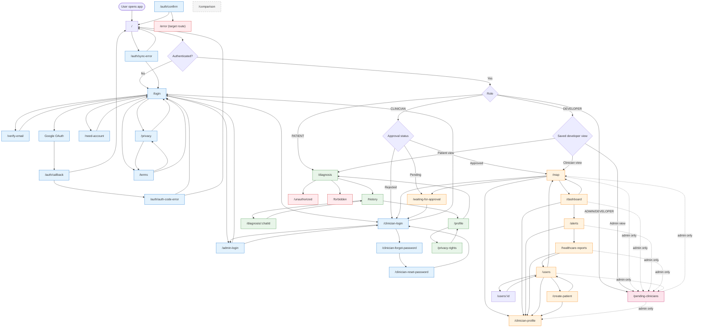

# System Page Navigation Flowchart

This document maps the whole-page navigation across the AI'll Be Sick frontend, including role-based entry paths, auth flows, patient pages, clinician/admin pages, and guard redirects.

## Overview

The application uses Next.js App Router with role-based access control. Users are routed based on authentication status, role (Patient, Clinician, Admin, Developer), and approval status. The system enforces guards that redirect unauthorized or unapproved users to appropriate pages.

## Navigation Flowchart

## Legend

### Node Types

| Shape   | Meaning          |
| ------- | ---------------- |
| `([ ])` | Start/End point  |
| `[ ]`   | Page/Route       |
| `{ }`   | Decision point   |
| `[/ /]` | External process |

### Line Types

| Style  | Meaning                      |
| ------ | ---------------------------- |
| `-->`  | Normal navigation flow       |
| `-.->` | Admin-only restricted access |

### Color Coding

| Color         | Area                        |
| ------------- | --------------------------- |
| Blue          | Authentication & Auth flows |
| Green         | Patient app area            |
| Orange        | Clinician operations area   |
| Pink          | Admin-only area             |
| Gray (dashed) | Standalone pages            |
| Red           | Error & guard pages         |

## Route Reference

### Public Routes (Unauthenticated)

- `/login` — Main login page
- `/verify-email` — Email verification page
- `/need-account` — Account selection page
- `/clinician-login` — Clinician login page
- `/admin-login` — Admin login page
- `/clinician-forgot-password` — Clinician password reset request
- `/clinician-reset-password` — Clinician password reset form
- `/privacy` — Privacy policy
- `/terms` — Terms of service
- `/auth/callback` — OAuth callback handler
- `/auth/auth-code-error` — OAuth error page
- `/auth/confirm` — Auth confirmation handler
- `/auth/sync-error` — Auth sync error page
- `/auth/expired-invite` — Expired invite error page
- `/auth/onboarding` — Onboarding page
- `/patient/set-password` — Patient password setting page (from invite link)

### Patient Routes (Authenticated + Patient Role)

- `/diagnosis` — Main diagnosis interface
- `/diagnosis/:chatId` — Individual chat/diagnosis detail
- `/history` — Diagnosis history
- `/profile` — Patient profile management
- `/privacy-rights` — Privacy rights dashboard and data management

### Clinician Routes (Authenticated + Approved Clinician)

- `/map` — Disease surveillance map
- `/dashboard` — Clinician dashboard (group overview cards open map via explicit **Open group on map** button)
- `/alerts` — Alert management
- `/healthcare-reports` — Healthcare reports and analytics
- `/users` — Patient/user management
- `/users/:id` — Individual user detail and account deletion management
- `/create-patient` — Create new patient account
- `/clinician-profile` — Clinician profile management
- `/waiting-for-approval` — Pending approval page (for unapproved clinicians)

### Admin Routes (Authenticated + Admin Role)

- `/pending-clinicians` — Clinician approval management

### Error & Guard Routes

- `/unauthorized` — Unauthorized access page
- `/forbidden` — Forbidden access page
- `/error` — Generic error page (target route)

### Standalone Routes

- `/comparison` — Diagnosis comparison tool

## Navigation Guards

### Authentication Guard

- **Trigger**: User not authenticated
- **Action**: Redirect to `/login`
- **Applies to**: All protected routes

### Clinician Approval Guard

- **Trigger**: Clinician role but not approved
- **Action**: Redirect to `/waiting-for-approval`
- **Applies to**: All clinician routes

### Role-Based Access Guard

- **Trigger**: User lacks required role
- **Action**: Redirect to `/unauthorized` or `/forbidden`
- **Applies to**: Role-specific routes

### Admin-Only Guard

- **Trigger**: Non-admin user accessing admin routes
- **Action**: Redirect to appropriate role landing page
- **Applies to**: `/pending-clinicians` and admin-only features

## Technical Notes

1. **OAuth Flow**: Google OAuth redirects to `/auth/callback`, which processes the token and redirects to `/` for re-evaluation
2. **Developer View**: Developers can switch between patient, clinician, and admin views via saved preference
3. **Clinician Profile**: Accessible from all clinician operations pages for quick profile updates
4. **Chat Detail**: `/diagnosis/:chatId` allows patients to view previous diagnosis sessions
5. **Admin Navigation**: Admins can access `/pending-clinicians` from any clinician operations page via dotted-line connections
6. **Error Recovery**: Auth sync errors redirect to `/login` or `/` to allow retry
7. **Comparison Tool**: `/comparison` is a standalone page not integrated into main navigation flow
