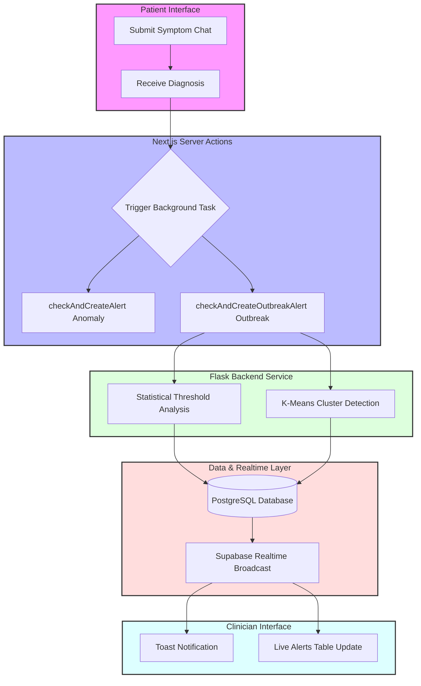
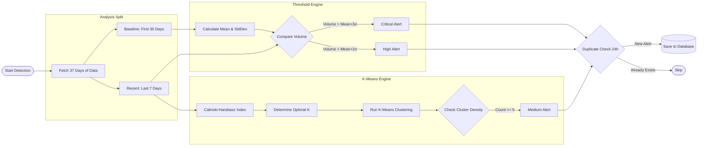
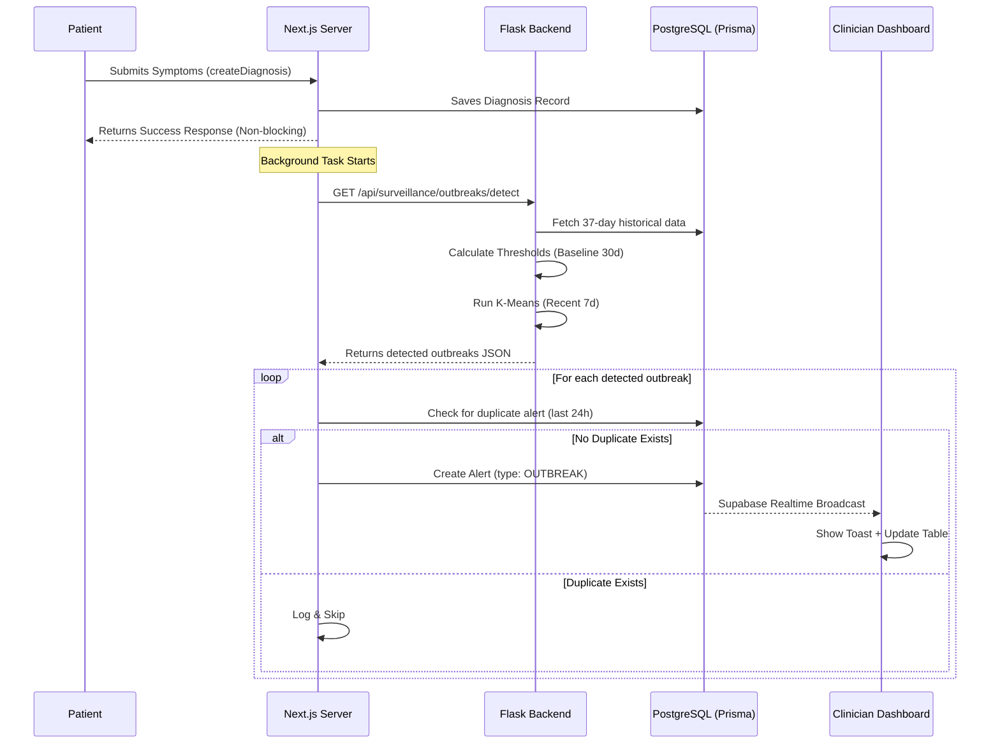

# Outbreak Alert System

## Overview

### Purpose
The Outbreak Alert System provides automated, real-time detection of collective disease patterns that suggest a local outbreak. While the Anomaly Detection system (Isolation Forest) flags individual unusual cases, the Outbreak Alert System uses statistical thresholds and clustering to identify when a specific disease is spreading abnormally within a district.

### Target Users
- **Epidemiologists & Public Health Officials**: To monitor disease trends and breach points in real-time.
- **Clinicians**: To receive early warnings about emerging health threats in their local area.
- **Healthcare Administrators**: To allocate resources based on the severity and location of detected outbreaks.

### Key Benefits
- **Automated Threshold Monitoring**: Replaces manual calculation of DOH alert/epidemic thresholds.
- **Spatial Clustering**: Identifies "hotspots" even before they reach a volume-based threshold.
- **Zero-Latency Notification**: Alerts appear on clinician dashboards within seconds of a triggering diagnosis.
- **Duplicate Prevention**: Intelligently groups related cases into a single actionable alert per 24-hour window.

---

## Step-by-Step Outbreak Detection Process

This section provides a high-level summary of how the system identifies and communicates potential outbreaks.

1. **The Trigger (Patient Diagnosis)**
   Whenever a patient completes a symptom chat and receives a diagnosis, the Next.js server saves the record and silently triggers the Outbreak Detection process in the background.

2. **Data Gathering (37-Day Window)**
   The Flask backend pulls the last **37 days** of diagnosis records from the database. It splits this data into two groups:
   - **The Baseline:** The first 30 days.
   - **The Recent Analysis:** The last 7 days.

3. **Establishing the "Normal" (Statistical Baseline)**
   Using the 30-day baseline data, the system groups records by *Disease* and *District*. It calculates the **Mean** (average daily cases) and the **Standard Deviation** (how much the cases normally fluctuate) to figure out what is "normal" for that specific area.

4. **Threshold Check (Volume Analysis)**
   The system then looks at the **Recent 7 days** of data and compares the case volume against the baseline using DOH-style epidemiological thresholds:
   - **Alert Threshold (High Priority):** If recent cases > Mean + 2 Standard Deviations.
   - **Epidemic Threshold (Critical Priority):** If recent cases > Mean + 3 Standard Deviations.

5. **K-Means Spatial Clustering (Hotspot Detection)**
   At the same time, the system runs K-Means clustering on the recent data's coordinates. 
   - It automatically determines the optimal number of clusters using the **Calinski-Harabasz Index**. 
   - If it finds a tight, dense cluster of 5 or more cases in a specific area, it flags a **Dense Cluster (Medium/High Priority)**.

6. **Spam Prevention (24-Hour Rule)**
   Before sounding the alarm, the Next.js server checks the database to see if an active `OUTBREAK` alert for that specific disease and district was already created in the last 24 hours. If so, it skips the alert to avoid spamming the dashboard.

7. **Real-Time Notification (Zero Latency)**
   The new alert is saved to the database. Because of Supabase Realtime, the database instantly broadcasts this change to all connected clinicians. The clinician sees a **Toast Notification** and the alert table updates instantly—no page refresh required.

---

## How It Works

### High-Level Architecture
The diagram below shows how a single diagnosis triggers a system-wide search for outbreaks, bridging the patient and clinician experiences.

```text
┌──────────────────────┐      ┌──────────────────────┐      ┌──────────────────────┐
│   Patient Interface  │      │ Next.js Server Action│      │   Flask Backend      │
│                      │      │                      │      │                      │
│ 1. Submit Symptoms   │─────▶│ 3. Diagnosis Saved   │─────▶│ 5. Threshold Analysis│
│ 2. Receive Diagnosis │      │ 4. Run Alert Checks  │      │ 6. Cluster Detection │
└──────────────────────┘      └──────────┬───────────┘      └──────────┬───────────┘
                                         │                             │
                                         ▼                             ▼
┌──────────────────────┐      ┌──────────────────────┐      ┌──────────────────────┐
│  Clinician Dashboard │      │  Supabase Realtime   │      │   PostgreSQL (DB)    │
│                      │      │                      │      │                      │
│ 9. Toast Notification│◀─────│ 8. Broadcast Event   │◀─────│ 7. Create Alert      │
│ 10. Table Updates    │      │    (WAL / Change)    │      │    (OUTBREAK Type)   │
└──────────────────────┘      └──────────────────────┘      └──────────────────────┘
```

#### Technical Mermaid Flow


### Statistical Methodology

#### Lineage: CDC EARS C1 Algorithm
The Outbreak Alert System utilizes a statistical methodology derived from the **CDC's Early Aberration Reporting System (EARS)**, specifically the **C1 (Mild)** algorithm. EARS is the gold standard for syndromic surveillance, designed to detect public health "aberrations" with minimal historical data.

**Key Architectural Comparisons:**

| Feature | Standard EARS C1 | Our Implementation |
| :--- | :--- | :--- |
| **Baseline Window** | 7 Days | **30 Days (Stable)** |
| **Analysis Window** | Today only ($t$) | **Last 7 Days (Rolling)** |
| **Alert Logic** | Mean + 3 StdDev | **Dual: Alert (2σ) & Epidemic (3σ)** |
| **Spatial Context** | Volumetric only | **Integrated K-Means Clustering** |

**Why these changes matter:**
- **Stability:** A 30-day baseline smooths out "day-of-the-week" effects (e.g., weekend reporting dips) that often cause false alarms in standard EARS C1.
- **Sensitivity:** By aggregating the last 7 days, the system can detect slow-building outbreaks (like Dengue clusters) that standard 1-day C1 might miss.
- **Precision:** Pairing volume data with K-Means spatial clustering ensures alerts are tied to localized geographic hotspots.

The system utilizes a dual-layered approach to detect outbreaks, combining traditional epidemiological statistics with modern machine learning.

#### 1. Statistical Thresholds
The system maintains a rolling **30-day historical baseline** for every (Disease, District) pair.
- **Mean ($\mu$)**: The average number of daily cases.
- **Standard Deviation ($\sigma$)**: The variation in daily case counts.

**Alert Logic**:
- **Alert Threshold**: $\mu + 2\sigma$. If recent volume exceeds this, it is flagged as **HIGH** severity.
- **Epidemic Threshold**: $\mu + 3\sigma$. If recent volume exceeds this, it is flagged as **CRITICAL** severity.

#### 2. K-Means Clustering (Spatial Density)
The system uses **unsupervised K-Means clustering** to find geographic "hotspots."
- **Optimal K Selection**: The system automatically calculates the best number of clusters ($k=2$ to $10$) using the **Calinski-Harabasz Index**, which measures cluster density and separation.
- **Density Check**: If a cluster contains $\ge 5$ cases within a 7-day window, it triggers a **MEDIUM** severity alert (`CLUSTER:DENSE`).

### Detection Pipeline Flow
The following diagram details the internal logic of the Outbreak Service during a single detection cycle:

```text
┌─────────────────┐      ┌──────────────────┐      ┌──────────────────┐
│ Start Detection │─────▶│ Fetch 37d Data   │─────▶│ Split Analysis   │
└─────────────────┘      └──────────────────┘      └─────────┬────────┘
                                                             │
                              ┌──────────────────────────────┴──────────────┐
                              ▼                                             ▼
                   [ Threshold Engine ]                          [ K-Means Cluster Engine ]
                   ┌──────────────────┐                          ┌──────────────────┐
                   │ 1. Calc Baselines│                          │ 1. Calc CH Index │
                   │ 2. Set Alert (2σ)│                          │ 2. Optimal K     │
                   │ 3. Set Epid (3σ) │                          │ 3. Run K-Means   │
                   └──────────┬───────┘                          └──────────┬───────┘
                              │                                             │
                              ▼                                             ▼
                   ┌──────────────────┐                          ┌──────────────────┐
                   │ Compare Volumes  │                          │ Check Density    │
                   │ (Count vs Stats) │                          │ (Count >= 5)     │
                   └──────────┬───────┘                          └──────────┬───────┘
                              │                                             │
                              └───────────────┬─────────────────────────────┘
                                              ▼
                                     ┌──────────────────┐          ┌──────────────────┐
                                     │ Duplicate Check  │─────────▶│ Save to Database │
                                     │ (24h Window)     │          └──────────────────┘
                                     └──────────────────┘
```

#### Technical Mermaid Flow


---

## Step-by-Step Flow



---

## Implementation Details

### Backend: `outbreak_service.py`
The core logic resides in the Flask backend. It fetches data through the `illness_cluster_service` and applies the statistical models.

**Key Reason Codes**:
- `OUTBREAK:EPIDEMIC_THRESHOLD`: Case volume exceeded Mean + 3 StdDev.
- `OUTBREAK:ALERT_THRESHOLD`: Case volume exceeded Mean + 2 StdDev.
- `CLUSTER:DENSE`: K-Means identified a high-density geographic cluster.
- `OUTBREAK:VOL_SPIKE`: Sudden increase in volume where no historical baseline exists.

### Frontend: Alert Pipeline
The system is triggered via a Server Action in `frontend/actions/create-diagnosis.ts`.

```typescript
// Triggered in the background after every diagnosis
checkAndCreateOutbreakAlert({
  disease,
  district: dbUser.district,
}).catch((err) => console.error("Outbreak alert failed", err));
```

### Database Schema
The `Alert` model in Prisma was extended to support the `OUTBREAK` type.

```prisma
enum AlertType {
  ANOMALY
  OUTBREAK
  LOW_CONFIDENCE
  HIGH_UNCERTAINTY
}

model Alert {
  id          Int       @id @default(autoincrement())
  type        AlertType
  severity    AlertSeverity
  metadata    Json?     // Stores threshold stats and counts
  ...
}
```

---

## Outbreak Metadata Schema

When an `OUTBREAK` alert is created, the `metadata` JSON field contains detailed evidence for the clinician:

| Field | Type | Description |
|-------|------|-------------|
| `disease` | `string` | The disease name (e.g., "Dengue") |
| `district` | `string` | The specific district/barangay |
| `count` | `number` | Number of cases detected in the last 7 days |
| `baseline_mean` | `number` | The calculated average for the last 30 days |
| `threshold_alert`| `number` | The value that triggers a High Alert ($\mu+2\sigma$) |
| `threshold_epidemic` | `number` | The value that triggers a Critical Alert ($\mu+3\sigma$) |
| `is_cluster` | `boolean` | True if K-Means density triggered the alert |

---

## Testing and Validation

### 1. Seeding Simulated Data
To test the system's sensitivity, use the provided seeding script to create a realistic outbreak scenario.

```bash
# Seeds 15 baseline cases + 15 spike cases
npx tsx scripts/seed-outbreak.ts
```

### 2. Manual Trigger
To force an outbreak check without submitting a new diagnosis, use the trigger script:

```bash
# Contacts backend, detects outbreaks, and saves to DB
npx tsx scripts/trigger-outbreak.ts
```

---

## Error Handling

| Scenario | Behavior |
|----------|----------|
| **Insufficient Data** | If $< 5$ cases exist in the system, detection returns empty to avoid false positives. |
| **Backend Offline** | The Next.js action logs a warning and fails gracefully; the patient's diagnosis is **never** blocked. |
| **Missing District** | The system falls back to `"UNKNOWN"` as the district label to ensure alerts are still generated even if geographic data is incomplete. |
| **Spam Prevention** | Alerts are throttled to once every 24 hours per unique disease/district combination. |

---

**Version**: 1.0
**Last Updated**: March 14, 2026
**Maintainer**: AI'll Be Sick Research & Development Team
