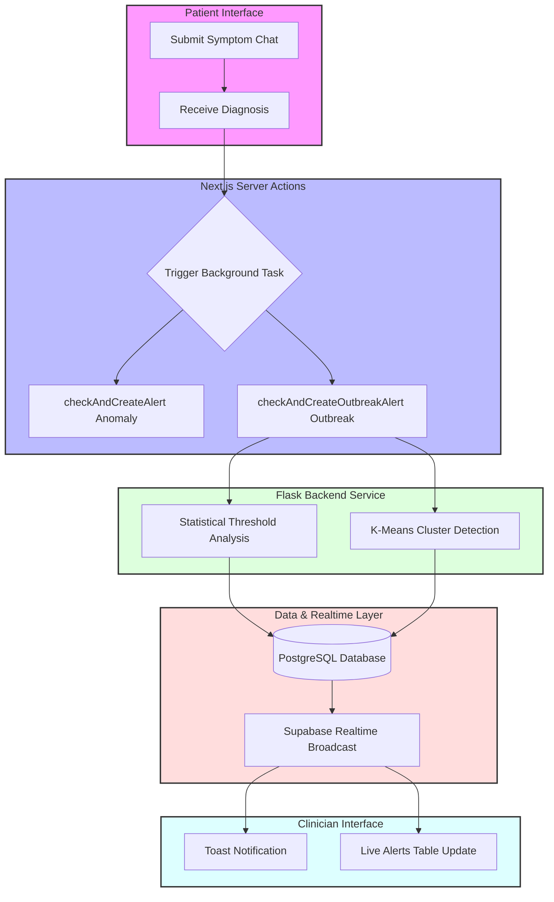
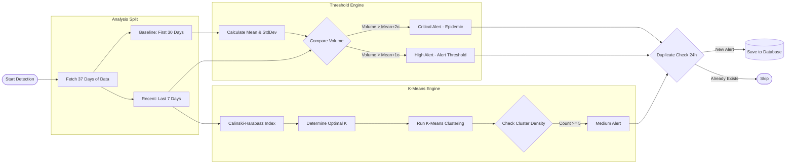
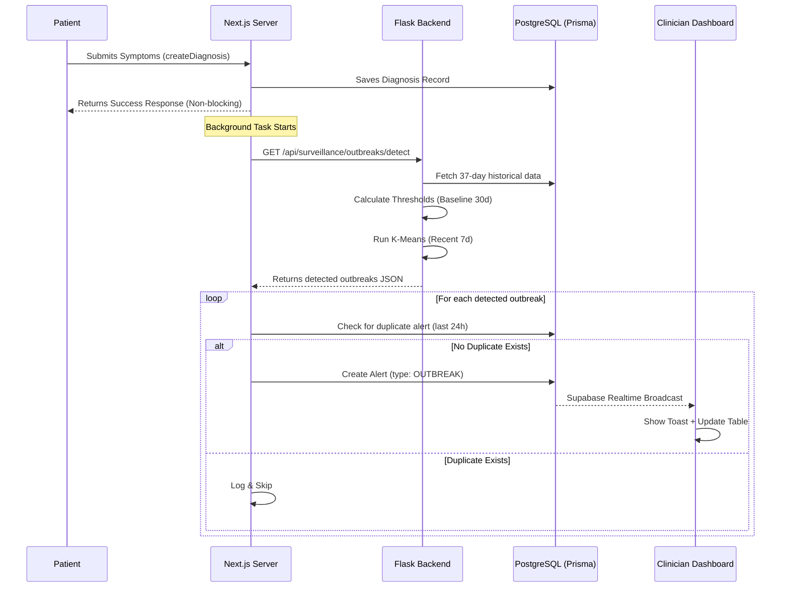

# Outbreak Alert System

## Overview

### Purpose
The Outbreak Alert System provides automated, real-time detection of collective disease patterns that suggest a local outbreak. While the Anomaly Detection system (Isolation Forest) flags individual unusual cases, the Outbreak Alert System uses statistical thresholds and clustering to identify when a specific disease is spreading abnormally within a district.

### Target Users
- **Epidemiologists & Public Health Officials**: To monitor disease trends and breach points in real-time.
- **Clinicians**: To receive early warnings about emerging health threats in their local area.
- **Healthcare Administrators**: To allocate resources based on the severity and location of detected outbreaks.

### Key Benefits
- **DOH PIDSR Compliance**: Implements DOH PIDSR (Philippine Integrated Disease Surveillance and Response) statistical thresholds aligned with national public health standards.
- **Automated Threshold Monitoring**: Replaces manual calculation of DOH alert/epidemic thresholds.
- **Spatial Clustering**: Identifies "hotspots" even before they reach a volume-based threshold.
- **Zero-Latency Notification**: Alerts appear on clinician dashboards within seconds of a triggering diagnosis.
- **Duplicate Prevention**: Intelligently groups related cases into a single actionable alert per 24-hour window.

---

## Step-by-Step Outbreak Detection Process

This section provides a high-level summary of how the system identifies and communicates potential outbreaks.

1. **The Trigger (Patient Diagnosis)**
   Whenever a patient completes a symptom chat and receives a diagnosis, the Next.js server saves the record and silently triggers the Outbreak Detection process in the background.

2. **Data Gathering (37-Day Window)**
   The Flask backend pulls the last **37 days** of diagnosis records from the database. It splits this data into two groups:
   - **The Baseline:** The first 30 days.
   - **The Recent Analysis:** The last 7 days.

3. **Establishing the "Normal" (Statistical Baseline)**
   Using the 30-day baseline data, the system groups records by *Disease* and *District*. It calculates the **Mean** (average daily cases) and the **Standard Deviation** (how much the cases normally fluctuate) to figure out what is "normal" for that specific area.

4. **Threshold Check (Volume Analysis)**
   The system then looks at the **Recent 7 days** of data and compares the case volume against the baseline using DOH PIDSR (Philippine Integrated Disease Surveillance and Response) statistical thresholds:
   - **Alert Threshold (High Priority):** If recent cases > Mean + 1 Standard Deviation (mean + 1σ).
   - **Epidemic Threshold (Critical Priority):** If recent cases > Mean + 2 Standard Deviations (mean + 2σ).

5. **K-Means Spatial Clustering (Hotspot Detection)**
   At the same time, the system runs K-Means clustering on the recent data's coordinates. 
   - It automatically determines the optimal number of clusters using the **Calinski-Harabasz Index**. 
   - If it finds a tight, dense cluster of 5 or more cases in a specific area, it flags a **Dense Cluster (Medium/High Priority)**.

   > **In plain terms:** While the Threshold Check (Step 4) only asks *"how many cases are there?"*, this step asks *"where are those cases happening?"* Every diagnosis has GPS coordinates attached to it. K-Means is an algorithm that groups those map coordinates into neighborhoods automatically. The Calinski-Harabasz Index acts as a scoring system to find the right number of groups — too few and you miss real hotspots, too many and random scatter looks like a cluster. If 5 or more cases end up tightly grouped in the same small area, the system flags it as a geographic hotspot even if the raw case count alone would not have triggered a threshold alert.
   >
   > **Why this matters:** Imagine 10 new Dengue cases across a whole district — that might be normal. But if 8 of those 10 cases are all within two blocks of each other, that strongly suggests a localized source (a stagnant water site, a school, etc.) and warrants an alert regardless of volume. The threshold check catches *volume-based* outbreaks; clustering catches *geographically concentrated* ones.

6. **Spam Prevention (24-Hour Rule)**
   Before sounding the alarm, the Next.js server checks the database to see if an active `OUTBREAK` alert for that specific disease and district was already created in the last 24 hours. If so, it skips the alert to avoid spamming the dashboard.

7. **Real-Time Notification (Zero Latency)**
   The new alert is saved to the database. Because of Supabase Realtime, the database instantly broadcasts this change to all connected clinicians. The clinician sees a **Toast Notification** and the alert table updates instantly—no page refresh required.

---

## How It Works

### High-Level Architecture
The diagram below shows how a single diagnosis triggers a system-wide search for outbreaks, bridging the patient and clinician experiences.

```text
┌──────────────────────┐      ┌──────────────────────┐      ┌──────────────────────┐
│   Patient Interface  │      │ Next.js Server Action│      │   Flask Backend      │
│                      │      │                      │      │                      │
│ 1. Submit Symptoms   │─────▶│ 3. Diagnosis Saved   │─────▶│ 5. Threshold Analysis│
│ 2. Receive Diagnosis │      │ 4. Run Alert Checks  │      │ 6. Cluster Detection │
└──────────────────────┘      └──────────┬───────────┘      └──────────┬───────────┘
                                         │                             │
                                         ▼                             ▼
┌──────────────────────┐      ┌──────────────────────┐      ┌──────────────────────┐
│  Clinician Dashboard │      │  Supabase Realtime   │      │   PostgreSQL (DB)    │
│                      │      │                      │      │                      │
│ 9. Toast Notification│◀─────│ 8. Broadcast Event   │◀─────│ 7. Create Alert      │
│ 10. Table Updates    │      │    (WAL / Change)    │      │    (OUTBREAK Type)   │
└──────────────────────┘      └──────────────────────┘      └──────────────────────┘
```

#### Technical Mermaid Flow


### Statistical Methodology

#### DOH PIDSR Statistical Thresholds
The Outbreak Alert System implements the **DOH PIDSR (Philippine Integrated Disease Surveillance and Response)** statistical methodology, which is the national standard for outbreak detection in the Philippines. PIDSR is designed to provide early warning signals for disease outbreaks using statistical thresholds based on historical baseline data.

**Key Architectural Comparisons:**

| Feature | DOH PIDSR Standard | Our Implementation |
| :--- | :--- | :--- |
| **Baseline Window** | 3-5 years (weekly/monthly) | **30 Days (adapted for limited historical data)** |
| **Analysis Window** | Current reporting period | **Last 7 Days (rolling daily aggregation)** |
| **Alert Threshold** | Mean + 1 StdDev (1σ) | **Mean + 1 StdDev (1σ)** ✓ |
| **Epidemic Threshold** | Mean + 2 StdDev (2σ) | **Mean + 2 StdDev (2σ)** ✓ |
| **Spatial Context** | Geographic region | **Integrated K-Means Clustering** |

**Implementation Notes:**
- **Baseline Adaptation:** While PIDSR typically uses 3-5 years of historical data, our implementation uses a 30-day rolling baseline due to limited historical data availability in the system. This provides a stable and responsive baseline that adapts to recent trends.
- **Increased Sensitivity:** PIDSR thresholds (1σ for Alert, 2σ for Epidemic) are more sensitive than CDC EARS C1 (3σ for alerts), enabling earlier detection of outbreaks at lower case volumes.
- **Daily Aggregation:** The 7-day rolling analysis window captures slow-building outbreaks that might be missed with single-day analysis.
- **Precision:** Pairing volume-based PIDSR thresholds with K-Means spatial clustering ensures alerts are tied to both statistical significance and localized geographic hotspots.

**References:**
- Philippine Statistician Vol. 66, No. 2 (2017) - DOH PIDSR statistical methodology
- WPSAR 2024 - Application of PIDSR thresholds in typhoid outbreak detection

The system utilizes a dual-layered approach to detect outbreaks, combining DOH PIDSR statistical thresholds with modern machine learning clustering techniques.

#### 1. DOH PIDSR Statistical Thresholds
The system maintains a rolling **30-day historical baseline** for every (Disease, District) pair.
- **Mean ($\mu$)**: The average number of daily cases.
- **Standard Deviation ($\sigma$)**: The variation in daily case counts.

**Alert Logic (DOH PIDSR Standard)**:
- **Alert Threshold**: $\mu + 1\sigma$ (Mean + 1 Standard Deviation). If recent volume exceeds this, it is flagged as **HIGH** severity.
- **Epidemic Threshold**: $\mu + 2\sigma$ (Mean + 2 Standard Deviations). If recent volume exceeds this, it is flagged as **CRITICAL** severity.

These thresholds follow the DOH PIDSR methodology, which is more sensitive than CDC EARS C1, enabling earlier outbreak detection.

#### 2. K-Means Clustering (Spatial Density)
The system uses **unsupervised K-Means clustering** to find geographic "hotspots."
- **Optimal K Selection**: The system automatically calculates the best number of clusters ($k=2$ to $10$) using the **Calinski-Harabasz Index**, which measures cluster density and separation.
- **Density Check**: If a cluster contains $\ge 5$ cases within a 7-day window, it triggers a **MEDIUM** severity alert (`CLUSTER:DENSE`).

---

## Disease-Specific Thresholds

The Outbreak Alert System applies different detection thresholds based on disease characteristics and DOH PIDSR guidelines.

### One-Case Diseases (Immediate Alert)

Certain diseases are considered high-priority and trigger alerts on **single case detection** per DOH PIDSR surveillance requirements:

| Disease | Alert Trigger | Epidemic Trigger | Severity | Rationale |
| :--- | :--- | :--- | :--- | :--- |
| **Measles (Tigdas)** | ≥ 1 case | ≥ 2 cases | HIGH → CRITICAL | Elimination-phase disease; zero tolerance for community transmission |

**Implementation:**
```python
ONE_CASE_DISEASES = {"MEASLES"}

# Logic in outbreak_service.py
is_one_case_disease = disease.upper() in ONE_CASE_DISEASES

if is_one_case_disease:
    if count >= 2:
        severity = "CRITICAL"  # Epidemic threshold
    elif count >= 1:
        severity = "HIGH"  # Alert threshold
```

**Why Measles is One-Case:**
- Measles is in the **elimination phase** in the Philippines
- Single cases indicate potential importation or vaccination gaps
- DOH PIDSR requires immediate investigation of any measles case
- High R0 (12-18) means rapid exponential spread if unchecked

### Standard Diseases (Volume-Based Thresholds)

For common diseases like **Dengue**, **Influenza**, **Typhoid Fever**, etc., the system uses statistical thresholds:

| Disease | Minimum Count | Alert Threshold | Epidemic Threshold | Severity Progression |
| :--- | :--- | :--- | :--- | :--- |
| **Dengue** | ≥ 3 cases | Mean + 1σ | Mean + 2σ | MEDIUM → HIGH → CRITICAL |
| **Influenza** | ≥ 3 cases | Mean + 1σ | Mean + 2σ | MEDIUM → HIGH → CRITICAL |
| **Typhoid Fever** | ≥ 3 cases | Mean + 1σ | Mean + 2σ | MEDIUM → HIGH → CRITICAL |
| **Diarrhea** | ≥ 3 cases | Mean + 1σ | Mean + 2σ | MEDIUM → HIGH → CRITICAL |
| **Pneumonia** | ≥ 3 cases | Mean + 1σ | Mean + 2σ | MEDIUM → HIGH → CRITICAL |
| **All others** | ≥ 3 cases | Mean + 1σ | Mean + 2σ | MEDIUM → HIGH → CRITICAL |

**Implementation:**
```python
# Minimum count filter for standard diseases
if not is_one_case_disease and count < 3:
    continue  # Skip detection

# Threshold-based severity assignment
if stats:  # Has historical baseline
    if count >= stats['epidemic']:  # Mean + 2σ
        severity = "CRITICAL"
    elif count >= stats['alert']:  # Mean + 1σ
        severity = "HIGH"
else:  # No baseline available
    if count >= 5:
        severity = "MEDIUM"  # Volume spike only
```

**Minimum Count Rationale:**
- **≥ 3 cases** prevents false positives from random fluctuations
- Balances sensitivity with specificity for endemic diseases
- Aligns with DOH PIDSR event-based surveillance guidelines

### Volume Spike Detection (No Baseline)

When no historical baseline exists (new disease or district), the system uses absolute thresholds:

| Condition | Threshold | Severity | Reason Code |
| :--- | :--- | :--- | :--- |
| **Volume Spike** | ≥ 5 cases in 7 days | MEDIUM | `OUTBREAK:VOL_SPIKE` |

This ensures detection even in data-sparse scenarios.

### Cluster Density Detection (Spatial)

K-Means clustering operates independently of disease type:

| Condition | Threshold | Severity | Reason Code |
| :--- | :--- | :--- | :--- |
| **Dense Cluster** | ≥ 5 cases in tight geographic cluster | MEDIUM | `CLUSTER:DENSE` |

**Cluster Detection Logic:**
- Runs on **all diseases simultaneously**
- Uses Calinski-Harabasz Index to find optimal k (2-10 clusters)
- Flags clusters with ≥ 5 cases in 7-day window
- Can trigger **even if volume thresholds are not met**

**Why Cluster Detection Matters:**
- Detects **localized transmission** before volume explodes
- Example: 8 Dengue cases in 2 blocks vs. 10 cases scattered across district
- Early warning for **point-source outbreaks** (contaminated water, mosquito breeding sites)

---

## Threshold Configuration Summary

| Parameter | Value | Configurable | Location |
| :--- | :--- | :--- | :--- |
| **Baseline Window** | 30 days | ✓ (env var) | `outbreak_service.py` |
| **Analysis Window** | 7 days | ✓ (env var) | `outbreak_service.py` |
| **One-Case Diseases** | `{"MEASLES"}` | ✓ (code) | `outbreak_service.py:18` |
| **Standard Min Count** | 3 cases | ✓ (code) | `outbreak_service.py:133` |
| **Alert Threshold** | Mean + 1σ | Formula | `outbreak_service.py:49` |
| **Epidemic Threshold** | Mean + 2σ | Formula | `outbreak_service.py:50` |
| **Volume Spike** | 5 cases | ✓ (code) | `outbreak_service.py:148` |
| **Cluster Min Count** | 5 cases | ✓ (code) | `outbreak_service.py:167` |
| **Cluster K Range** | 2-10 | ✓ (code) | `outbreak_service.py:75` |
| **Duplicate Window** | 24 hours | ✓ (code) | Frontend action |

**Environment Variables (Future Enhancement):**
```bash
# Add to backend/.env
OUTBREAK_BASELINE_DAYS=30
OUTBREAK_ANALYSIS_DAYS=7
OUTBREAK_MIN_COUNT_STANDARD=3
OUTBREAK_MIN_COUNT_CLUSTER=5
ONE_CASE_DISEASES=MEASLES,CHOLERA,DIPHTHERIA
```

### Detection Pipeline Flow
The following diagram details the internal logic of the Outbreak Service during a single detection cycle:

```text
┌─────────────────┐      ┌──────────────────┐      ┌──────────────────┐
│ Start Detection │─────▶│ Fetch 37d Data   │─────▶│ Split Analysis   │
└─────────────────┘      └──────────────────┘      └─────────┬────────┘
                                                             │
                              ┌──────────────────────────────┴──────────────┐
                              ▼                                             ▼
                    [ Threshold Engine ]                          [ K-Means Cluster Engine ]
                    ┌──────────────────┐                          ┌──────────────────┐
                    │ 1. Calc Baselines│                          │ 1. Calc CH Index │
                    │ 2. Set Alert (1σ)│                          │ 2. Optimal K     │
                    │ 3. Set Epid (2σ) │                          │ 3. Run K-Means   │
                    └──────────┬───────┘                          └──────────┬───────┘
                              │                                             │
                              ▼                                             ▼
                   ┌──────────────────┐                          ┌──────────────────┐
                   │ Compare Volumes  │                          │ Check Density    │
                   │ (Count vs Stats) │                          │ (Count >= 5)     │
                   └──────────┬───────┘                          └──────────┬───────┘
                              │                                             │
                              └───────────────┬─────────────────────────────┘
                                              ▼
                                     ┌──────────────────┐          ┌──────────────────┐
                                     │ Duplicate Check  │─────────▶│ Save to Database │
                                     │ (24h Window)     │          └──────────────────┘
                                     └──────────────────┘
```

#### Technical Mermaid Flow


---

## Step-by-Step Flow



---

## Implementation Details

### Backend: `outbreak_service.py`
The core logic resides in the Flask backend. It fetches data through the `illness_cluster_service` and applies the statistical models.

**Key Reason Codes**:
- `OUTBREAK:EPIDEMIC_THRESHOLD`: Case volume exceeded Mean + 2 StdDev (DOH PIDSR Epidemic Threshold).
- `OUTBREAK:ALERT_THRESHOLD`: Case volume exceeded Mean + 1 StdDev (DOH PIDSR Alert Threshold).
- `CLUSTER:DENSE`: K-Means identified a high-density geographic cluster.
- `OUTBREAK:VOL_SPIKE`: Sudden increase in volume where no historical baseline exists.

### Frontend: Alert Pipeline
The system is triggered via a Server Action in `frontend/actions/create-diagnosis.ts`.

```typescript
// Triggered in the background after every diagnosis
checkAndCreateOutbreakAlert({
  disease,
  district: dbUser.district,
}).catch((err) => console.error("Outbreak alert failed", err));
```

### Database Schema
The `Alert` model in Prisma was extended to support the `OUTBREAK` type.

```prisma
enum AlertType {
  ANOMALY
  OUTBREAK
  LOW_CONFIDENCE
  HIGH_UNCERTAINTY
}

model Alert {
  id          Int       @id @default(autoincrement())
  type        AlertType
  severity    AlertSeverity
  metadata    Json?     // Stores threshold stats and counts
  ...
}
```

---

## Outbreak Metadata Schema

When an `OUTBREAK` alert is created, the `metadata` JSON field contains detailed evidence for the clinician:

| Field | Type | Description |
|-------|------|-------------|
| `disease` | `string` | The disease name (e.g., "Dengue") |
| `district` | `string` | The specific district/barangay |
| `count` | `number` | Number of cases detected in the last 7 days |
| `baseline_mean` | `number` | The calculated average for the last 30 days |
| `threshold_alert`| `number` | The DOH PIDSR Alert Threshold value ($\mu+1\sigma$) |
| `threshold_epidemic` | `number` | The DOH PIDSR Epidemic Threshold value ($\mu+2\sigma$) |
| `is_cluster` | `boolean` | True if K-Means density triggered the alert |

---

## Testing and Validation

### 1. Seeding Simulated Data
To test the system's sensitivity, use the provided seeding script to create a realistic outbreak scenario.

```bash
# Seeds 15 baseline cases + 15 spike cases
npx tsx scripts/seed-outbreak.ts
```

### 2. Manual Trigger
To force an outbreak check without submitting a new diagnosis, use the trigger script:

```bash
# Contacts backend, detects outbreaks, and saves to DB
npx tsx scripts/trigger-outbreak.ts
```

---

## Error Handling

| Scenario | Behavior |
|----------|----------|
| **Insufficient Data** | If $< 5$ cases exist in the system, detection returns empty to avoid false positives. |
| **Backend Offline** | The Next.js action logs a warning and fails gracefully; the patient's diagnosis is **never** blocked. |
| **Missing District** | The system falls back to `"UNKNOWN"` as the district label to ensure alerts are still generated even if geographic data is incomplete. |
| **Spam Prevention** | Alerts are throttled to once every 24 hours per unique disease/district combination. |

---

**Version**: 2.0 (DOH PIDSR Migration)
**Last Updated**: March 22, 2026
**Maintainer**: AI'll Be Sick Research & Development Team

---

## Changelog

### Version 2.0 - March 22, 2026
- **Migrated from CDC EARS C1 to DOH PIDSR methodology**
  - Alert Threshold: Changed from mean + 2σ to mean + 1σ
  - Epidemic Threshold: Changed from mean + 3σ to mean + 2σ
  - Updated all documentation to reflect DOH PIDSR compliance
  - Added academic references (Philippine Statistician Vol. 66 No. 2, WPSAR 2024)
- **Rationale**: Align with Philippines national public health standards for outbreak surveillance
- **Impact**: More sensitive outbreak detection, enabling earlier public health response

### Version 1.0 - March 14, 2026
- Initial implementation with CDC EARS C1-derived thresholds
- K-Means spatial clustering integration
- Real-time Supabase notifications
